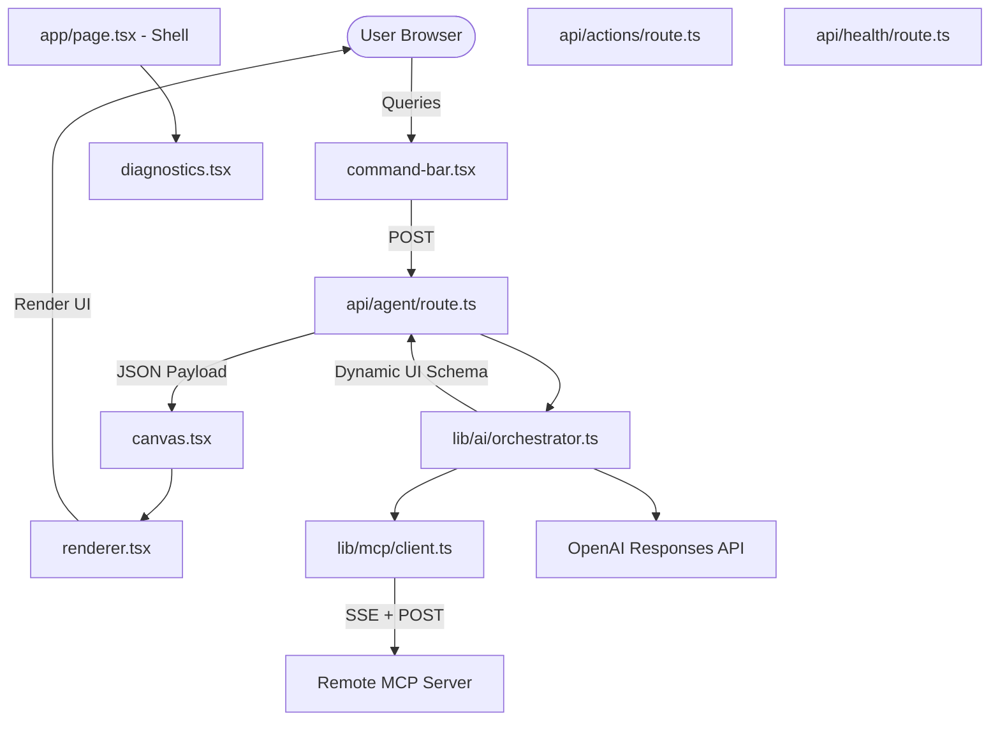

# BUSINESSNEXT AI Workspace

BUSINESSNEXT AI Workspace is a production-quality, enterprise-grade AI-native operating interface over a corporate CRM. 

It orchestrates user requests through the OpenAI Responses API, queries remote Model Context Protocol (MCP) server endpoints dynamically, audits operations, and renders high-density banking layouts (Customer 360, Pipeline dashboards, service desks) conforming to the BUSINESSNEXT design system.

---

## Architecture Diagram



---

## Directory Structure

```text
/app
  /api
    /agent/route.ts          # Main orchestrator API endpoint
    /actions/route.ts        # Action execution API endpoint
    /health/route.ts         # Diagnostic health checks
    /mcp/route.ts            # Discovered tools & schema diagnostics
  /admin
    /integrations/page.tsx   # Admin dashboard for tool mappings & audits
  /page.tsx                  # Home layout containing search canvas
  /layout.tsx                # Font loading (Poppins) and HTML wrapper
/components
  /businessnext
    /shell.tsx               # Collapsible enterprise navigation sidebar
    /command-bar.tsx         # Multiline prompt input with progress statuses
    /canvas.tsx              # Workspace dashboard container
    /renderer.tsx            # Trusted UI schema component builder
    /diagnostics.tsx         # AI Activity overlay diagnostics drawer
/lib
  /ai
    /orchestrator.ts         # OpenAI + MCP tool binder and fallback router
    /prompts.ts              # Agent system prompt grounding directives
    /ui-schema.ts            # Zod validation schema contracts
  /mcp
    /client.ts               # Remote MCP SSE-over-POST connector
  /security
    /audit.ts                # Audit trails for write authorizations
```

---

## Installation & Running Locally

### 1. Prerequisites
- Node.js (v18.0.0 or higher)
- npm or yarn

### 2. Install Dependencies
Run the package installation:
```bash
npm install
```

### 3. Environment Configuration
Create a `.env.local` file in the root directory (based on `.env.example`):
```env
OPENAI_API_KEY=your_openai_api_key_here
OPENAI_MODEL=gpt-5.6-terra
CRM_MCP_SERVER_URL=https://headlessmcp.vercel.app/mcp
```

### 4. Run Development Server
Start the Next.js server locally:
```bash
npm run dev
```
Open [http://localhost:3000](http://localhost:3000) in your browser.

---

## Core Security Considerations
1. **Server-side Execution**: All AI reasoning and MCP client connections occur strictly server-side. No API keys or endpoint credentials are exposed to browser JavaScript.
2. **Input/Output Validation**: The schema returned by the AI is validated using Zod (`lib/ai/ui-schema.ts`) before rendering. No execution of arbitrary AI-generated JavaScript or HTML is allowed.
3. **Write Confirmations**: Every state-modifying action (e.g. creating a lead) is intercepted. The orchestrator returns a `confirmation` component showing the exact payload, requiring the user to explicitly click "Confirm & Authorize" before executing POST `/api/actions`.
4. **Audit Trail**: Audit trail records track execution timestamp, actionCategory (READ/WRITE), status, and latency, providing full observability.

---

## Expanding the Workspace

### Adding UI Components
To add support for a new layout component:
1. Register the component name in `UIComponentTypeEnum` inside `lib/ai/ui-schema.ts`.
2. Add a rendering block for the new case inside `RenderSingleComponent` in `components/businessnext/renderer.tsx`.
3. Add instructions in `lib/ai/prompts.ts` telling the AI when and how to return the new component.

### Adding MCP Capabilities
The orchestrator reads the tools dynamically at runtime via `McpClient.listTools()`. If the remote MCP server is updated to expose new tools, the AI Copilot will automatically discover and use them.

---

## Troubleshooting
- **MCP Connection Failures (500 / 406)**: Ensure the server sends the correct headers. Our client sets `Accept: application/json, text/event-stream` to comply with FastMCP's Streamable HTTP transport check.
- **Model Config**: If `gpt-5.6-terra` is not supported by your API key, the orchestrator automatically falls back to `gpt-4o` for completions.
